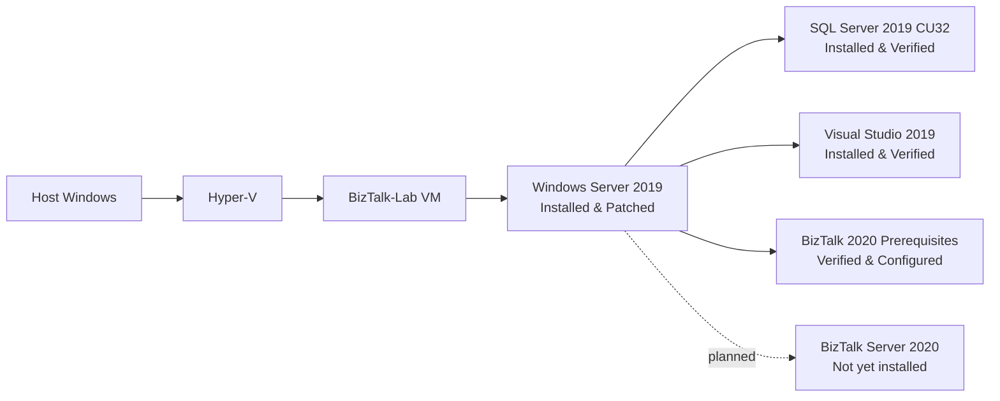

# BizTalk to Azure Migration Lab

## Overview

This repository is a hands-on learning and architecture lab for understanding a legacy BizTalk integration environment and migrating it to Azure Integration Services.

The goal is not a one-to-one lift and shift. The lab will first document the existing artifacts, dependencies, workloads, and integration patterns. Those findings will then guide an appropriate Azure design.

## Why this lab exists

The lab is intended to build practical experience with:

- BizTalk architecture
- Legacy integration discovery
- Integration patterns
- Migration decisions
- Azure Integration Services
- Architecture trade-offs

## Migration approach

The intended lifecycle is:

**Discover → Plan → Convert → Validate → Deploy**

The project takes a patterns-first, tools-second approach. Technology choices will follow discovery and analysis rather than precede them.

## Current architecture status

The project has reached a stable prerequisite baseline. Windows Server, SQL Server 2019 CU32, Visual Studio 2019, and the BizTalk Server 2020 prerequisites are installed or verified as applicable; BizTalk Server itself is not installed.

## Current progress

### Completed

- [x] Repository initialized
- [x] Documentation structure created
- [x] Hyper-V lab created
- [x] Windows Server 2019 Standard Evaluation (Desktop Experience) installed
- [x] VM network verified
- [x] Clean Windows Server checkpoint created
- [x] Windows Server 2019 patched to latest security baseline (10.0.17763.9121)
- [x] SQL Server 2019 Developer installed and verified
- [x] SQL Server readiness checkpoint created
- [x] SQL Server 2019 updated to supported CU level (CU32 15.0.4430.1)
- [x] Visual Studio 2019 Enterprise installed and verified
- [x] Visual Studio 2019 component readiness verified for BizTalk Developer Tools
- [x] BizTalk Server 2020 prerequisites verified and configured (.NET 4.8, VC++ x86/x64, OLE DB 18.7.4.0, Hardened Local MSDTC)
- [x] Basic Service Bus namespace and queue created; send, Peek, PeekLock, Complete, and dead-letter behavior observed in the Portal

### In progress

- [ ] BizTalk Server 2020 media acquisition `[BLOCKED — installation media]`
- [ ] A1 Service Bus Queue Delivery and Settlement
- [ ] Verify the initiated .NET 8 Function App deployment

### Next

- [ ] Connect a minimal Azure Function consumer to the Service Bus queue
- [ ] Resume BizTalk Server 2020 installation when legitimate supported media is available
- [ ] Install BizTalk Server 2020 core components
- [ ] Configure BizTalk Server 2020 single-machine environment
- [ ] Select and deploy a BizTalk sample application
- [ ] Perform discovery and dependency analysis
- [ ] Identify integration patterns
- [ ] Design the Azure target architecture
- [ ] Begin migration implementation

## Planned learning areas

- Schemas
- Maps
- Orchestrations
- Pipelines
- Receive Ports
- Receive Locations
- Send Ports
- MessageBox concepts
- Synchronous and asynchronous integration
- Request/reply
- Publish/subscribe
- Content-based routing
- Transformation
- Retry and resilience
- Dead-letter handling
- Distributed transactions and Saga patterns
- Observability
- Security and managed identity

## Current execution strategy

BizTalk Server 2020 installation is temporarily blocked by legitimate installation-media availability, but the prepared VM baseline and BizTalk track remain preserved. Azure-side integration exercises will proceed in parallel using official Microsoft guidance, with emphasis on observable behavior, failure modes, service-selection reasoning, and later comparison with BizTalk—not on writing applications from scratch.

The reviewed sequence and source links are in [Azure Integration Pattern Labs](docs/AZURE-PATTERN-LABS.md).

## Learning Notes

Concise Q&A notes are maintained alongside the hands-on migration work for quick review and architecture recall. See [BizTalk to Azure — Learning Notes](docs/LEARNING-NOTES.md).

## Learning & Migration Roadmap

The project tracks both hands-on implementation and the ability to understand, explain, and defend architecture decisions. The [master learning roadmap](docs/ROADMAP.md) defines completion standards, phased labs, expected deliverables, and senior-level readiness criteria.

| Area | Status |
| --- | --- |
| Lab Foundation | Complete |
| Windows Server | Installed and patched |
| SQL Server | Installed and patched (CU32) |
| Visual Studio | Installed |
| BizTalk Prerequisites | Verified & configured (Hardened Local MSDTC) |
| BizTalk Server | Not installed |
| Microsoft BizTalk Pattern Labs | Not started |
| Discovery | Not started |
| Azure Migration | Not started |
| Validation | Not started |
| Deployment | Not started |

## Repository structure

- `docs/` contains discovery notes, architecture records, the migration roadmap, the Azure pattern-lab execution plan, learning notes, and the lab setup log.
- `legacy-biztalk/` is reserved for the legacy sample solution and related artifacts after they exist.
- `azure/` is reserved for future Azure implementation artifacts after migration design is complete.

## Status

The stable prerequisite baseline, learning review, and Visual Studio readiness verification are complete. BizTalk Server is not installed because legitimate media acquisition is blocked; the next executable task is the first Azure-side queue behavior lab after subscription and cost approval.
