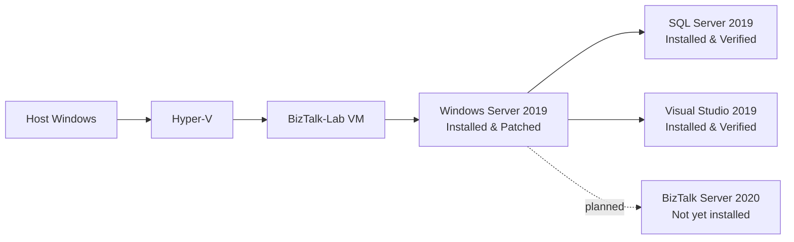

# BizTalk to Azure Migration Lab

## Overview

This repository is a hands-on learning and architecture lab for understanding a legacy BizTalk integration environment and migrating it to Azure Integration Services.

The goal is not a one-to-one lift and shift. The lab will first document the existing artifacts, dependencies, workloads, and integration patterns. Those findings will then guide an appropriate Azure design.

## Why this lab exists

The lab is intended to build practical experience with:

- BizTalk architecture
- Legacy integration discovery
- Integration patterns
- Migration decisions
- Azure Integration Services
- Architecture trade-offs

## Migration approach

The intended lifecycle is:

**Discover → Plan → Convert → Validate → Deploy**

The project takes a patterns-first, tools-second approach. Technology choices will follow discovery and analysis rather than precede them.

## Current architecture status

The project is currently in the legacy environment setup phase. Windows Server, SQL Server, and Visual Studio are installed; SQL Server servicing is in progress, and BizTalk Server is not installed.

## Current progress

### Completed

- [x] Repository initialized
- [x] Documentation structure created
- [x] Hyper-V lab created
- [x] Windows Server 2019 Standard Evaluation (Desktop Experience) installed
- [x] VM network verified
- [x] Clean Windows Server checkpoint created
- [x] Windows Server 2019 patched to latest security baseline (10.0.17763.9121)
- [x] SQL Server 2019 Developer installed and verified
- [x] SQL Server readiness checkpoint created
- [x] Visual Studio 2019 Enterprise installed and verified

### In progress

- [ ] Updating SQL Server 2019 from RTM to an appropriate supported CU/security build

### Next

- [ ] Install BizTalk Server 2020
- [ ] Select and deploy a BizTalk sample application
- [ ] Perform discovery and dependency analysis
- [ ] Identify integration patterns
- [ ] Design the Azure target architecture
- [ ] Begin migration implementation

## Planned learning areas

- Schemas
- Maps
- Orchestrations
- Pipelines
- Receive Ports
- Receive Locations
- Send Ports
- MessageBox concepts
- Synchronous and asynchronous integration
- Request/reply
- Publish/subscribe
- Content-based routing
- Transformation
- Retry and resilience
- Dead-letter handling
- Distributed transactions and Saga patterns
- Observability
- Security and managed identity

## Learning & Migration Roadmap

The project tracks both hands-on implementation and the ability to understand, explain, and defend architecture decisions. The [master learning roadmap](docs/ROADMAP.md) defines completion standards, phased labs, expected deliverables, and senior-level readiness criteria.

| Area | Status |
| --- | --- |
| Lab Foundation | In progress |
| Windows Server | Installed and patched |
| SQL Server | Installed; CU/security update in progress |
| Visual Studio | Installed |
| BizTalk Server | Not installed |
| Microsoft BizTalk Pattern Labs | Not started |
| Discovery | Not started |
| Azure Migration | Not started |
| Validation | Not started |
| Deployment | Not started |

## Repository structure

- `docs/` contains discovery notes, architecture records, pattern analysis, the migration roadmap, and the lab setup log.
- `legacy-biztalk/` is reserved for the legacy sample solution and related artifacts after they exist.
- `azure/` is reserved for future Azure implementation artifacts after migration design is complete.

## Status

This repository is a work in progress and will evolve as the migration lab progresses.
